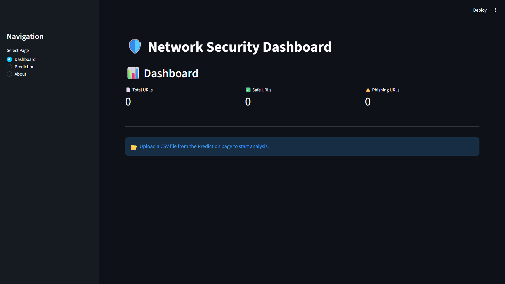

# 🛡️ Network Security – Phishing Website Detection System

A Machine Learning-based web application that detects and classifies websites as **Safe** or **Phishing** using a trained classification model.

The project includes a **FastAPI backend** for model inference and an interactive **Streamlit dashboard** for uploading datasets, generating predictions, analyzing results, and downloading prediction reports.

---

## 🚀 Features

* 📂 Upload CSV datasets for prediction
* 🤖 Machine Learning-based phishing detection
* ⚡ FastAPI backend for model inference
* 🎨 Interactive Streamlit dashboard
* 📊 Prediction analytics and visualization
* 🥧 Pie charts and bar charts
* 🔎 Search prediction results
* 📥 Download prediction reports
* 🗄️ MongoDB Atlas integration
* 📈 MLflow model tracking

---

## 🛠️ Tech Stack

### Programming Language

* Python

### Machine Learning & Data Processing

* Scikit-learn
* Pandas
* NumPy

### Backend

* FastAPI
* Uvicorn

### Frontend / Dashboard

* Streamlit

### Database

* MongoDB Atlas

### Model Tracking

* MLflow

### Data Visualization

* Plotly Express

---

## 🏗️ Project Architecture

```text
                    ┌─────────────────┐
                    │   CSV Dataset   │
                    └────────┬────────┘
                             │
                             ▼
                    ┌─────────────────┐
                    │ Data Ingestion  │
                    └────────┬────────┘
                             │
                             ▼
                    ┌─────────────────┐
                    │ Data Validation │
                    └────────┬────────┘
                             │
                             ▼
                    ┌─────────────────┐
                    │Data Transformation│
                    └────────┬────────┘
                             │
                             ▼
                    ┌─────────────────┐
                    │  Model Training │
                    └────────┬────────┘
                             │
                             ▼
                    ┌─────────────────┐
                    │   Prediction    │
                    └────────┬────────┘
                             │
                             ▼
                    ┌─────────────────┐
                    │    Streamlit    │
                    │    Dashboard    │
                    └────────┬────────┘
                             │
                             ▼
                    ┌─────────────────┐
                    │ Results & Charts│
                    └─────────────────┘
```

---

## 📊 Prediction Labels

| Prediction | Meaning          |
| ---------- | ---------------- |
| `0`        | Safe Website     |
| `1`        | Phishing Website |

---

## 📸 Application Screenshots

### Dashboard


### Prediction Analysis


### Prediction Results



---

## 📂 Project Structure

```text
NetworkSecurity/
│
├── .github/
│   └── workflows/
│
├── .streamlit/
├── data_schema/
├── final_model/
├── Network_Data/
├── networksecurity/
├── prediction_output/
├── templates/
├── valid_data/
│
├── app.py
├── main.py
├── streamlit_app.py
├── push_data.py
├── test_mongodb.py
│
├── requirements.txt
├── setup.py
├── README.md
└── .gitignore
```

---

## ⚙️ Installation

### 1. Clone the Repository

```bash
git clone https://github.com/ranjitdarji/networksecurity.git
cd networksecurity
```

### 2. Create a Virtual Environment

```bash
python -m venv venv
```

### 3. Activate the Virtual Environment

#### Windows

```bash
venv\Scripts\activate
```

#### Linux / macOS

```bash
source venv/bin/activate
```

### 4. Install Dependencies

```bash
pip install -r requirements.txt
```

---

## ▶️ Run the FastAPI Backend

Start the FastAPI server:

```bash
uvicorn app:app --reload
```

The API documentation will be available at:

```text
http://127.0.0.1:8000/docs
```

---

## ▶️ Run the Streamlit Dashboard

Open another terminal and run:

```bash
streamlit run streamlit_app.py
```

The Streamlit dashboard will open in your browser.

---

## 📈 Dashboard Capabilities

The dashboard provides:

* Dataset upload
* Dataset information
* Prediction summary
* Safe vs phishing prediction analysis
* Pie chart visualization
* Bar chart visualization
* Searchable prediction results
* CSV prediction report download

---

## 🔄 Machine Learning Workflow

```text
Data Collection
       ↓
Data Ingestion
       ↓
Data Validation
       ↓
Data Transformation
       ↓
Model Training
       ↓
Model Evaluation
       ↓
MLflow Tracking
       ↓
Prediction
       ↓
FastAPI
       ↓
Streamlit Dashboard
```

---

## 🗄️ Database

The project uses **MongoDB Atlas** for storing and managing project-related data.

---

## 📈 MLflow

MLflow is used for experiment and model tracking during the Machine Learning workflow.

It helps manage:

* Experiments
* Parameters
* Metrics
* Models

---

## 🔮 Future Improvements

* URL-based real-time phishing detection
* User authentication
* Cloud deployment
* Real-time website analysis
* Email alerts
* Improved model performance
* Production-ready monitoring

---

## 🎯 Project Objective

The main objective of this project is to build an end-to-end Machine Learning application that can assist in identifying potentially phishing websites and demonstrate the integration of **Machine Learning, APIs, databases, experiment tracking, and an interactive web interface**.

---

## 👨‍💻 Developer

**Ranjit Darji**

Engineering Student

### Interests

* Machine Learning
* Data Science
* Python
* MLOps
* Backend Development

---

## ⭐ Support

If you find this project useful, consider giving the repository a ⭐ on GitHub.

---

## 📜 License

This project is intended for educational and portfolio purposes.
